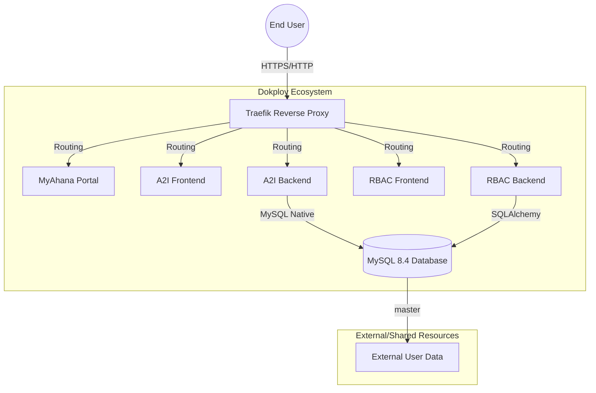
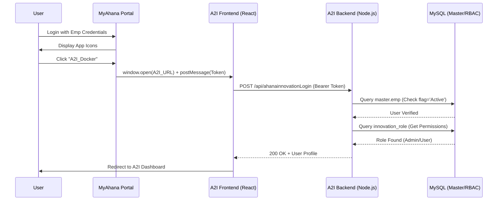

# Ahana Innovation Lab: Technical Architecture & Service Guide

This document provides a detailed overview of the Dokploy-based infrastructure, service communication flows, and the Centralized RBAC ecosystem for the Ahana Innovation Lab.

---

## 🏗️ 1. Infrastructure Overview

The system is hosted on an **Azure VM (Ubuntu)** running **Dokploy** on top of **Docker Swarm**. This setup provides high availability, automatic container restarts, and integrated Traefik routing.

### **High-Level Diagram**

---

## 🔐 2. Centralized RBAC System

The **Centralized RBAC (Role-Based Access Control)** suite is the master identity provider for the ecosystem.

| Service           | Technology                 | Role                                                          |
| :---------------- | :------------------------- | :------------------------------------------------------------ |
| **RBAC Backend**  | FastAPI (Python)           | Manages user permissions, app registration, and audit logs.   |
| **RBAC Frontend** | React / Vite               | Administrative UI for managing roles and employee access.     |
| **RBAC Database** | MySQL (`centralized_rbac`) | Stores application-specific roles and user-role associations. |

---

## 🔄 3. SSO Flow (The Handshake)

The Single Sign-On flow utilizes a "Trusted Token" mechanism initiated by the MyAhana Portal.

### **Authentication Sequence**

---

## 📊 4. Database Schema Map

The single MySQL container manages three primary logical databases:

1.  **`master`**:
    *   `emp`: The source of truth for all employee data (emp_id, email, flag).
2.  **`ahana_innovation_lab`**:
    *   `innovation_role`: Maps employees to A2I-specific roles.
    *   `innovationtask_details`: Core data for the Innovation Lab module.
    *   `automation_requests`: Core data for the Automation module.
3.  **`centralized_rbac`**:
    *   `application_roles`: Defines permissions per app.
    *   `employee_role_associations`: The link between master employees and app roles.

---

## ⚙️ 5. Key Configurations (Dokploy)

### **Build-time Arguments (VITE/REACT)**
Because React/Vite are static builds, environment variables must be passed during the **Build** phase in Dokploy, not runtime.
*   **A2I:** `REACT_APP_BACKEND_URL` must point to the backend Traefik URL.
*   **RBAC:** `VITE_API_BASE_URL` must point to the RBAC Backend URL.

### **MySQL 8.4 Native Password Fix**
Since the backend uses older Node drivers, the MySQL service in Dokploy is configured with:
*   **Command:** `mysqld`
*   **Argument:** `--mysql-native-password=ON`
*   **Reason:** To allow authentication using the legacy protocol required by the `mysql` npm package.

---

## 🚀 6. Maintenance & Deployment

*   **Logs:** Accessible via Dokploy dashboard or `docker service logs <service_name> -f`.
*   **Redeploy:** Any change to `VITE_` or `REACT_APP_` variables requires a **Full Redeploy** (rebuild) of the Frontend services.
*   **User Sync:** Users must exist in the `master.emp` table with `flag='Active'` to successfully use the SSO flow.

---
*Documentation generated by Antigravity AI - Feb 2026*
